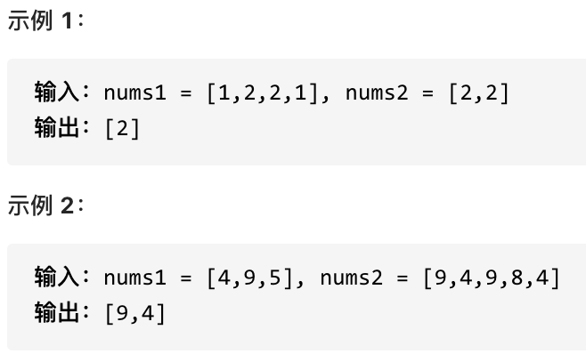
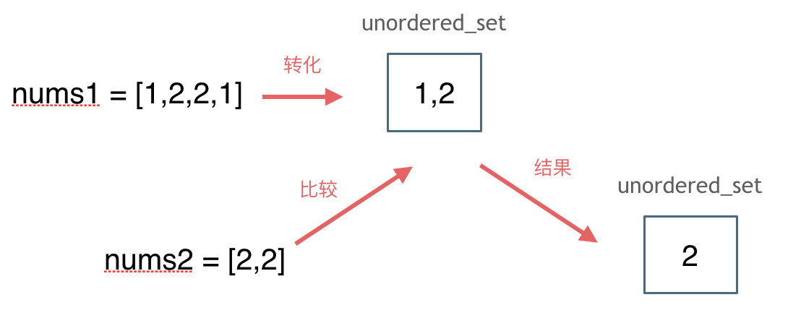

# 1. 哈希表基础理论

哈希表（英文名字为Hash table，国内也有一些算法书籍翻译为散列表，大家看到这两个名称知道都是指hash table就可以了）。

> 哈希表是根据关键码的值而直接进行访问的数据结构。

其实直白来讲其实数组就是一张哈希表。

哈希表中关键码就是数组的索引下标，然后通过下标直接访问数组中的元素，如下图所示：


***一般哈希表都是用来快速判断一个元素是否出现集合里。***

例如要查询一个名字是否在这所学校里。

要枚举的话时间复杂度是$O(n)$，但如果使用哈希表的话， 只需要$O(1)$就可以做到。

我们只需要初始化把这所学校里学生的名字都存在哈希表里，在查询的时候通过索引直接就可以知道这位同学在不在这所学校里了。

将学生姓名映射到哈希表上就涉及到了hash function ，也就是**哈希函数**。

## 哈希函数

哈希函数，把学生的姓名直接映射为哈希表上的索引，然后就可以通过查询索引下标快速知道这位同学是否在这所学校里了。

哈希函数如下图所示，通过hashCode把名字转化为数值，一般hashcode是通过特定编码方式，可以将其他数据格式转化为不同的数值，这样就把学生名字映射为哈希表上的索引数字了。


如果hashCode得到的数值大于 哈希表的大小了，也就是大于tableSize了，怎么办呢？

此时为了保证映射出来的索引数值都落在哈希表上，我们会在再次对数值做一个**取模**的操作，就要我们就保证了学生姓名一定可以映射到哈希表上了。

此时问题又来了，哈希表我们刚刚说过，就是一个数组。

如果学生的数量大于哈希表的大小怎么办，此时就算哈希函数计算的再均匀，也避免不了会有几位学生的名字同时映射到哈希表 同一个索引下标的位置。

接下来<u>**哈希碰撞登场**</u>

## 哈希碰撞

如图所示，小李和小王都映射到了索引下标 1 的位置，这一现象叫做哈希碰撞。


一般哈希碰撞有两种解决方法， **拉链法**和**线性探测法**。

### 拉链法

发生冲突的元素都被存储在链表中。


（数据规模是dataSize， 哈希表的大小为tableSize）

其实拉链法就是要选择适当的哈希表的大小，这样既不会因为数组空值而<u>浪费大量内存</u>，也不会因为链表太长而在查找上浪费太多时间。

### 线性探测法

使用线性探测法，一定要保证tableSize大于dataSize。 我们需要依靠哈希表中的空位来解决碰撞问题。

例如冲突的位置，放了小李，那么就向下找一个空位放置小王的信息。所以要求<u>**tableSize一定要大于dataSize**</u>，要不然哈希表上就没有空置的位置来存放 冲突的数据了。如图所示：


## 三种哈希结构

* 数组
* set（集合）
* map（映射）

| 集合               | 底层实现 | 是否有序 | 数值是否可以重复 | 能否更改数值 | 查询效率    | 增删效率    |
| ------------------ | -------- | -------- | ---------------- | ------------ | ----------- | ----------- |
| std::set           | 红黑树   | 有序     | 否               | 否           | $O(\log n)$ | $O(\log n)$ |
| std::multiset      | 红黑树   | 有序     | 是               | 否           | $O(\log n)$ | $O(\log n)$ |
| std::unordered_set | 哈希表   | 无序     | 否               | 否           | $O(1)$      | $O(1)$      |

* std::unordered_set底层实现为哈希表
* std::set 和std::multiset 的底层实现是红黑树
> * 红黑树是一种平衡二叉搜索树，所以key值是有序的
> * 但key不可以修改，改动key值会导致整棵树的错乱，所以<u>***只能***</u>***删除和增加***。


| 映射               | 底层实现 | 是否有序 | 数值是否可以重复 | 能否更改数值 | 查询效率    | 增删效率    |
| ------------------ | -------- | -------- | ---------------- | ------------ | ----------- | ----------- |
| std::map           | 红黑树   | key有序  | key不可重复      | key不可修改  | $O(\log n)$ | $O(\log n)$ |
| std::multimap      | 红黑树   | key有序  | key可重复        | key不可修改  | $O(\log n)$ | $O(\log n)$ |
| std::unordered_map | 哈希表   | key无序  | key不可重复      | key不可修改  | $O(1)$      | $O(1)$      |

* std::unordered_map 底层实现为哈希表
* std::map 和std::multimap 的底层实现是红黑树。
> * 同理，std::map 和std::multimap 的key也是有序的（这个问题也经常作为面试题，考察对语言容器底层的理解）。

> * 当我们要使用集合来解决哈希问题的时候，优先使用unordered_set，因为它的查询和增删效率是最优的
> * 如果需要集合是有序的，那么就用set
> * 如果要求不仅有序还要有重复数据的话，那么就用multiset。

# 2. 有效的字母异位词

## 题目

给定两个字符串 s 和 t ，编写一个函数来判断 t 是否是 s 的字母异位词。

示例 1: 输入: s = "anagram", t = "nagaram" 输出: true

示例 2: 输入: s = "rat", t = "car" 输出: false

说明: 你可以假设字符串只包含小写字母。

## 思路

先看暴力的解法，两层for循环，同时还要记录字符是否重复出现，很明显时间复杂度是 $O(n^2)$。

暴力的方法这里就不做介绍了，直接看一下有没有更优的方式。

**数组其实就是一个简单哈希表**，而且这道题目中字符串只有小写字符，那么就可以定义一个数组，来记录字符串s里字符出现的次数。

需要定义一个多大的数组呢，定一个数组叫做record，大小为26 就可以了，初始化为0，因为字符a到字符z的ASCII也是26个连续的数值。

为了方便举例，判断一下字符串s= "aee", t = "eae"。

操作动画如下：


定义一个数组叫做record用来上记录字符串s里字符出现的次数。

需要把字符映射到数组也就是哈希表的索引下标上，***因为字符a到字符z的ASCII是26个连续的数值，所以字符a映射为下标0，相应的字符z映射为下标25。***

再遍历 字符串s的时候，**只需要将 s[i] - ‘a’ 所在的元素做+1 操作即可，并不需要记住字符a的ASCII，只要求出一个相对数值就可以了。** 这样就将字符串s中字符出现的次数，统计出来了。

那看一下如何检查字符串t中是否出现了这些字符，同样在遍历字符串t的时候，对t中出现的字符映射哈希表索引上的数值再做-1的操作。

那么最后检查一下，**record数组如果有的元素不为零0，说明字符串s和t一定是谁多了字符或者谁少了字符，return false。**

最后如果record数组所有元素都为零0，说明字符串s和t是字母异位词，return true。

时间复杂度为$O(n)$，空间上因为定义是的一个常量大小的辅助数组，所以空间复杂度为$O(1)$。

代码：
```
class Solution {
public:
    bool isAnagram(string s, string t) {
        int record[26] = {0};
        for (int i = 0; i < s.size(); i++) {
            // 并不需要记住字符a的ASCII，只要求出一个相对数值就可以了
            record[s[i] - 'a']++;
        }
        for (int i = 0; i < t.size(); i++) {
            record[t[i] - 'a']--;
        }
        for (int i = 0; i < 26; i++) {
            if (record[i] != 0) {
                // record数组如果有的元素不为零0，说明字符串s和t 一定是谁多了字符或者谁少了字符。
                return false;
            }
        }
        // record数组所有元素都为零0，说明字符串s和t是字母异位词
        return true;
    }
};
```

# 3. 两个数组的交集

## 题目

题意：给定两个数组，编写一个函数来计算它们的交集。



说明： 输出结果中的每个元素一定是唯一的。 我们可以不考虑输出结果的顺序。

## 思路

这道题目，主要要学会使用一种哈希数据结构：***<u>unordered_set</u>***，这个数据结构可以解决很多类似的问题。

注意题目特意说明：***输出结果中的每个元素一定是唯一的，也就是说输出的结果的去重的， 同时可以不考虑输出结果的顺序***

要注意，***使用数组来做哈希的题目，是因为题目都限制了数值的大小。***

而这道题目没有限制数值的大小，就无法使用数组来做哈希表了。

而且如果***哈希值比较少、特别分散、跨度非常大，使用数组就造成空间的极大浪费。***

此时就要使用另一种结构体了，set ，关于set，C++ 给提供了如下三种可用的数据结构：

    std::set
    std::multiset
    std::unordered_set

std::set和std::multiset底层实现都是红黑树，std::unordered_set的底层实现是哈希表， 使用unordered_set 读写效率是最高的，并不需要对数据进行排序，而且还不要让数据重复，所以选择unordered_set。

思路如图所示：



```
class Solution {
public:
    vector<int> intersection(vector<int>& nums1, vector<int>& nums2) {
        unordered_set<int> result_set; // 存放结果
        unordered_set<int> nums_set(nums1.begin(), nums1.end());
        for (int num : nums2) {
            // 发现nums2的元素 在nums_set里又出现过
            if (nums_set.find(num) != nums_set.end()) {
                result_set.insert(num);
            }
        }
        return vector<int>(result_set.begin(), result_set.end());
    }
};
```

# 快乐数

## 题目

编写一个算法来判断一个数 n 是不是快乐数。

「快乐数」定义为：对于一个正整数，每一次将该数替换为它每个位置上的数字的平方和，然后重复这个过程直到这个数变为 1，也可能是 无限循环 但始终变不到 1。如果 可以变为  1，那么这个数就是快乐数。

如果 n 是快乐数就返回 True ；不是，则返回 False 。

示例：

输入：19
输出：true
解释：
1^2 + 9^2 = 82
8^2 + 2^2 = 68
6^2 + 8^2 = 100
1^2 + 0^2 + 0^2 = 1

## 思路

这道题目看上去貌似一道数学问题，其实并不是！

题目中说了会 *无限循环*，那么也就是说求和的过程中，***sum会重复出现***，这对解题很重要！

***当我们遇到了要快速判断一个元素是否出现集合里的时候，就要考虑哈希法了。***

所以这道题目使用哈希法，来判断这个sum是否重复出现，如果重复了就是return false， 否则一直找到sum为1为止。

判断sum是否重复出现就可以使用unordered_set。

还有一个难点就是求和的过程，如果对<u>**取数值各个位上的单数操作**</u>不熟悉的话，做这道题也会比较艰难。

代码如下：
```
class Solution {
public:
    // 取数值各个位上的单数之和
    int getSum(int n) {
        int sum = 0;
        while (n) {
            sum += (n % 10) * (n % 10);
            n /= 10;
        }
        return sum;
    }
    bool isHappy(int n) {
        unordered_set<int> set;
        while(1) {
            int sum = getSum(n);
            if (sum == 1) {
                return true;
            }
            // 如果这个sum曾经出现过，说明已经陷入了无限循环了，立刻return false
            if (set.find(sum) != set.end()) {
                return false;
            } else {
                set.insert(sum);
            }
            n = sum;
        }
    }
};
```