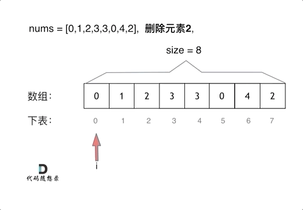
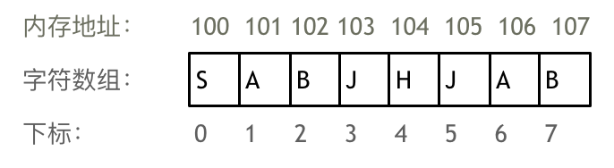
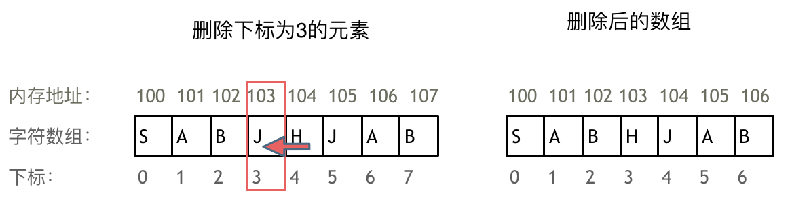

# 1.数组理论基础

## License

* * *

# 2.二分查找

## 题目

    给定一个 n 个元素有序的（升序）整型数组 nums 和一个目标值 target  ，写一个函数搜索 nums 中的 target，如果目标值存在返回下标，否则返回 -1。

* 示例一：

>输入: nums = [-1,0,3,5,9,12], target = 9
输出: 4
解释: 9 出现在 nums 中并且下标为 4  

* 示例二：

>输入: nums = [-1,0,3,5,9,12], target = 2
输出: -1
解释: 2 不存在 nums 中因此返回 -1  

* 提示：

> 你可以假设 nums 中的所有元素是不重复的。
    n 将在 [1, 10000]之间。
    nums 的每个元素都将在 [-9999, 9999]之间。

## 思路

* 二分法前提条件：
>
> * 数组为***有序数组***
> * 题目还强调***数组中无重复元素***
> >
> > * 因为一旦有重复元素，使用二分查找法返回的元素下标可能不是唯一的

写二分法经常写乱，主要是因为对区间的定义没有想清楚，区间的定义就是不变量。要在二分查找的过程中，保持不变量，就是在while寻找中每一次边界的处理都要坚持根据区间的定义来操作，这就是***循环不变量规则***。

## 二分法的两种写法

### 第一种写法(左闭右闭)

> * 我们定义 target 是在一个在左闭右闭的区间里，也就是[left, right] （这个很重要非常重要）。
>
>> * while (left <= right) 要使用 <= ，因为left == right是有意义的，所以使用 <=
>> * if (nums[middle] > target) right 要赋值为 middle - 1，因为当前这个nums[middle]一定不是target，那么接下来要查找的左区间结束下标位置就是 middle - 1
>>
* 例如在数组：1,2,3,4,7,9,10中查找元素2，如图所示：


```
// 版本一
class Solution {
public:
    int search(vector<int>& nums, int target) {
        int left = 0;
        int right = nums.size() - 1; // 定义target在左闭右闭的区间里，[left, right]
        while (left <= right) { // 当left==right，区间[left, right]依然有效，所以用 <=
            int middle = left + ((right - left) / 2);// 防止溢出 等同于(left + right)/2
            if (nums[middle] > target) {
                right = middle - 1; // target 在左区间，所以[left, middle - 1]
            } else if (nums[middle] < target) {
                left = middle + 1; // target 在右区间，所以[middle + 1, right]
            } else { // nums[middle] == target
                return middle; // 数组中找到目标值，直接返回下标
            }
        }
        // 未找到目标值
        return -1;
    }
};
```

### 第二种写法（左闭右开)

> * 如果说定义 target 是在一个在左闭右开的区间里，也就是[left, right) ，那么二分法的边界处理方式则截然不同
>
> > * while (left < right)，这里使用 < ,因为left == right在区间[left, right)是没有意义的
> > * if (nums[middle] > target) right 更新为 middle，因为当前nums[middle]不等于target，去左区间继续寻找，而寻找区间是左闭右开区间，所以right更新为middle，即：下一个查询区间不会去比较nums[middle]
>
> * 在数组：1,2,3,4,7,9,10中查找元素2，如图所示：（注意和方法一的区别）


```
// 版本二
class Solution {
public:
    int search(vector<int>& nums, int target) {
        int left = 0;
        int right = nums.size(); // 定义target在左闭右开的区间里，即：[left, right)
        while (left < right) { // 因为left == right的时候，在[left, right)是无效的空间，所以使用 <
            int middle = left + ((right - left) >> 1);
            if (nums[middle] > target) {
                right = middle; // target 在左区间，在[left, middle)中
            } else if (nums[middle] < target) {
                left = middle + 1; // target 在右区间，在[middle + 1, right)中
            } else { // nums[middle] == target
                return middle; // 数组中找到目标值，直接返回下标
            }
        }
        // 未找到目标值
        return -1;
    }
};
```

* * *

# 3.移除元素

## 题目

 给你一个数组 nums 和一个值 val，你需要 原地 移除所有数值等于 val 的元素，并返回移除后数组的新长度。

不要使用额外的数组空间，你必须仅使用 $O(1)$ 额外空间并原地修改输入数组。

元素的顺序可以改变。你不需要考虑数组中超出新长度后面的元素。

示例 1: 给定 nums = [3,2,2,3], val = 3, 函数应该返回新的长度 2, 并且 nums 中的前两个元素均为 2。 你不需要考虑数组中超出新长度后面的元素。

示例 2: 给定 nums = [0,1,2,2,3,0,4,2], val = 2, 函数应该返回新的长度 5, 并且 nums 中的前五个元素为 0, 1, 3, 0, 4。

你不需要考虑数组中超出新长度后面的元素。

## 思路

***数组的元素在内存地址中是连续的，不能单独删除数组中的某个元素，只能覆盖。***

## 暴力解法
这个题目暴力的解法就是两层for循环，一个for循环遍历数组元素 ，第二个for循环更新数组。

删除过程如下：



很明显暴力解法的时间复杂度是$O(n^2)$，这道题目暴力解法在leetcode上是可以过的。

```
// 时间复杂度：O(n^2)
// 空间复杂度：O(1)
class Solution {
public:
    int removeElement(vector<int>& nums, int val) {
        int size = nums.size();
        for (int i = 0; i < size; i++) {
            if (nums[i] == val) { // 发现需要移除的元素，就将数组集体向前移动一位
                for (int j = i + 1; j < size; j++) {
                    nums[j - 1] = nums[j];
                }
                i--; // 因为下标i以后的数值都向前移动了一位，所以i也向前移动一位
                size--; // 此时数组的大小-1
            }
        }
        return size;

    }
};
```
* 时间复杂度：$O(n^2)$
* 空间复杂度：$O(1)$

## 双指针法（快慢指针法）

***通过一个快指针和慢指针在一个for循环下完成两个for循环的工作。***

删除过程如下：


***双指针法（快慢指针法）在数组和链表的操作中是非常常见的，很多考察数组、链表、字符串等操作的面试题，都使用双指针法。***
```
// 时间复杂度：O(n)
// 空间复杂度：O(1)
class Solution {
public:
    int removeElement(vector<int>& nums, int val) {
        int slowIndex = 0;
        for (int fastIndex = 0; fastIndex < nums.size(); fastIndex++) {
            if (val != nums[fastIndex]) {
                nums[slowIndex++] = nums[fastIndex];
            }
        }
        return slowIndex;
    }
};
```
这些实现方法并没有改变元素的相对位置！
* 时间复杂度：$O(n)$
* 时间复杂度：$O(n)$

# 4.有序数组的平方

## 题目
给你一个按 非递减顺序 排序的整数数组 nums，返回 每个数字的平方 组成的新数组，要求也按 非递减顺序 排序。

示例 1： 输入：nums = [-4,-1,0,3,10] 输出：[0,1,9,16,100] 解释：平方后，数组变为 [16,1,0,9,100]，排序后，数组变为 [0,1,9,16,100]

示例 2： 输入：nums = [-7,-3,2,3,11] 输出：[4,9,9,49,121]

## 思路

### 暴力排序

```
class Solution {
public:
    vector<int> sortedSquares(vector<int>& A) {
        for (int i = 0; i < A.size(); i++) {
            A[i] *= A[i];
        }
        sort(A.begin(), A.end()); // 快速排序
        return A;
    }
};
```
时间复杂度：$O(n + n\log n)$

### 双指针法

>数组其实是有序的， 只不过负数平方之后可能成为最大数了。
>
>那么数组平方的最大值就在数组的两端，不是最左边就是最右边，不可能是中间。
>
>此时可以考虑双指针法了，i指向起始位置，j指向终止位置。
>
>定义一个新数组result，和A数组一样的大小，让k指向result数组终止位置。
>
>如果A[i] * A[i] < A[j] * A[j] 那么result[k--] = A[j] * A[j]; 。
>
>如果A[i] * A[i] >= A[j] * A[j] 那么result[k--] = A[i] * A[i]; 。
>
如动画所示：


```
class Solution {
public:
    vector<int> sortedSquares(vector<int>& A) {
        int k = A.size() - 1;
        vector<int> result(A.size(), 0);
        for (int i = 0, j = A.size() - 1; i <= j;) { // 注意这里要i <= j，因为最后要处理两个元素
            if (A[i] * A[i] < A[j] * A[j])  {
                result[k--] = A[j] * A[j];
                j--;
            }
            else {
                result[k--] = A[i] * A[i];
                i++;
            }
        }
        return result;
    }
};
```
时间复杂度：$O(n)$

# 5.长度最小的子数组

## 题目

>给定一个含有 n 个正整数的数组和一个正整数 s ，找出该数组中满足其和 ≥ s 的长度最小的 连续 子数组，并返回其长度。如果不存在符合条件的子数组，返回 0。
>
>示例：
>
>输入：s = 7, nums = [2,3,1,2,4,3] 输出：2 解释：子数组 [4,3] 是该条件下的长度最小的子数组。

## 暴力解法
```
class Solution {
public:
    int minSubArrayLen(int s, vector<int>& nums) {
        int result = INT32_MAX; // 最终的结果
        int sum = 0; // 子序列的数值之和
        int subLength = 0; // 子序列的长度
        for (int i = 0; i < nums.size(); i++) { // 设置子序列起点为i
            sum = 0;
            for (int j = i; j < nums.size(); j++) { // 设置子序列终止位置为j
                sum += nums[j];
                if (sum >= s) { // 一旦发现子序列和超过了s，更新result
                    subLength = j - i + 1; // 取子序列的长度
                    result = result < subLength ? result : subLength;
                    break; // 因为我们是找符合条件最短的子序列，所以一旦符合条件就break
                }
            }
        }
        // 如果result没有被赋值的话，就返回0，说明没有符合条件的子序列
        return result == INT32_MAX ? 0 : result;
    }
};
```
* 时间复杂度：$O(n^2)$
* 空间复杂度：$O(1)$

## 滑动窗口

> 所谓滑动窗口，就是***不断的调节子序列的起始位置和终止位置***，从而得出我们要想的结果。

这里还是以题目中的示例来举例，s=7， 数组是 2，3，1，2，4，3，来看一下查找的过程：


> 最后找到 4，3 是最短距离。
>
> 其实从动画中可以发现滑动窗口也可以理解为双指针法的一种！只不过这种解法更像是一个窗口的移动，所以叫做滑动窗口更适合一些。

> 在本题中实现滑动窗口，主要确定如下三点：
> > * 窗口内是什么？
> > 
> >     窗口就是 满足其和 ≥ s 的长度最小的 连续 子数组。
> 
> > * 如何移动窗口的起始位置？
> >     
> >     窗口的起始位置如何移动：如果当前窗口的值大于s了，窗口就要向前移动了（也就是该缩小了）。
> 
> > * 如何移动窗口的结束位置？
> >     
> >     窗口的结束位置如何移动：窗口的结束位置就是遍历数组的指针，窗口的起始位置设置为数组的起始位置就可以了。

> 解题的关键在于 窗口的起始位置如何移动，如图所示：
>
> 
> 
> 可以发现滑动窗口的精妙之处在于***根据当前子序列和大小的情况，不断调节子序列的起始位置***。
> ```
> class Solution {
> public:
>     int minSubArrayLen(int s, vector<int>& nums) {
>         int result = INT32_MAX;
>         int sum = 0; // 滑动窗口数值之和
>         int i = 0; // 滑动窗口起始位置
>         int subLength = 0; // 滑动窗口的长度
>         for (int j = 0; j < nums.size(); j++) {
>             sum += nums[j];
>             // 注意这里使用while，每次更新 i（起始位置），并不断比较子序列> 是否符合条件
>             while (sum >= s) {
>                 subLength = (j - i + 1); // 取子序列的长度
>                 result = result < subLength ? result : subLength;
>                 sum -= nums[i++]; // 这里体现出滑动窗口的精髓之处，不断> 变更i（子序列的起始位置）
>             }
>         }
>         // 如果result没有被赋值的话，就返回0，说明没有符合条件的子序列
>         return result == INT32_MAX ? 0 : result;
>     }
> };
> ```
> * 时间复杂度:$O(n)$ 
> 
>   为什么时间复杂度是$O(n)$：
> >     不要以为for里放一个while就以为是$O(n^2)$啊， 主要是看每一个元素被操作的次数，每个元素在滑动窗后进来操作一次，出去操作一次，每个元素都是被被操作两次，所以时间复杂度是 2 × n 也就是$O(n)$。
> 
> * 空间复杂度：$O(1)$

# 6.螺旋矩阵II

## 题目

>给定一个正整数 n，生成一个包含 1 到 n^2 所有元素，且元素按顺时针顺序螺旋排列的正方形矩阵。
>
>示例:
>
>输入: 3 输出: [ [ 1, 2, 3 ], [ 8, 9, 4 ], [ 7, 6, 5 ] ]

## 思路
 
> 要坚持循环不变量原则。
> 
> 模拟顺时针画矩阵的过程:
>
> > *  填充上行从左到右
> > *  填充右列从上到下
> > *  填充下行从右到左
> > *  填充左列从下到上
> 
> 由外向内一圈一圈这么画下去。

> 这里一圈下来，我们要画每四条边，这四条边怎么画，每画一条边都要坚持一致的左闭右开，或者左开又闭的原则，这样这一圈才能按照统一的规则画下来。
>
> 那么我按照左闭右开的原则，来画一圈：
> 
> 
> >
> 这里每一种颜色，代表一条边，我们遍历的长度，可以看出每一个拐角处的处理规则，拐角处让给新的一条边来继续画。
>
>这也是坚持了每条边左闭右开的原则。

> 代码如下：

```
class Solution {
public:
    vector<vector<int>> generateMatrix(int n) {
        vector<vector<int>> res(n, vector<int>(n, 0)); // 使用vector定义一个二维数组
        int startx = 0, starty = 0; // 定义每循环一个圈的起始位置
        int loop = n / 2; // 每个圈循环几次，例如n为奇数3，那么loop = 1 只是循环一圈，矩阵中间的值需要单独处理
        int mid = n / 2; // 矩阵中间的位置，例如：n为3， 中间的位置就是(1，1)，n为5，中间位置为(2, 2)
        int count = 1; // 用来给矩阵中每一个空格赋值
        int offset = 1; // 每一圈循环，需要控制每一条边遍历的长度
        int i,j;
        while (loop --) {
            i = startx;
            j = starty;

            // 下面开始的四个for就是模拟转了一圈
            // 模拟填充上行从左到右(左闭右开)
            for (j = starty; j < starty + n - offset; j++) {
                res[startx][j] = count++;
            }
            // 模拟填充右列从上到下(左闭右开)
            for (i = startx; i < startx + n - offset; i++) {
                res[i][j] = count++;
            }
            // 模拟填充下行从右到左(左闭右开)
            for (; j > starty; j--) {
                res[i][j] = count++;
            }
            // 模拟填充左列从下到上(左闭右开)
            for (; i > startx; i--) {
                res[i][j] = count++;
            }

            // 第二圈开始的时候，起始位置要各自加1， 例如：第一圈起始位置是(0, 0)，第二圈起始位置是(1, 1)
            startx++;
            starty++;

            // offset 控制每一圈里每一条边遍历的长度
            offset += 2;
        }

        // 如果n为奇数的话，需要单独给矩阵最中间的位置赋值
        if (n % 2) {
            res[mid][mid] = count;
        }
        return res;
    }
};
```

# 7.总结

## 数组理论基础

* ***数组是存放在连续内存空间上的相同类型数据的集合。***

* 数组可以方便的通过下标索引的方式获取到下标下对应的数据。

> 

需要两点注意的是:
> * 数组下标都是从0开始的。
>
> * 数组内存空间的地址是连续的
> 
> 正是因为数组的在内存空间的地址是连续的，所以我们在删除或者增添元素的时候，就难免要移动其他元素的地址。
>
> 例如删除下标为3的元素，需要对下标为3的元素后面的所有元素都要做移动操作，如图所示：
> 
> 

如果使用C++的话，要注意vector 和 array的区别，vector的底层实现是array，严格来讲vector是容器，不是数组。

***数组的元素是不能删的，只能覆盖。***

### 二维数组


二维数组在内存的空间地址是连续的么？

> 来举一个例子，例如： int[][] rating = new int[3][4]; ， 这个二维数据在内存空间可不是一个 3*4 的连续地址空间
>
> 

所以***二维数据在内存中不是 $3*4$ 的连续地址空间，而是四条连续的地址空间组成！***

## 数组的经典题目

### 二分法

### 双指针法

通过一个快指针和慢指针在一个for循环下完成两个for循环的工作。

>注意：

    数组在内存中是连续的地址空间，不能释放单一元素，如果要释放，就是全释放（程序运行结束，回收内存栈空间）。
    C++中vector和array的区别一定要弄清楚，vector的底层实现是array，封装后使用更友好。

### 滑动窗口

***滑动窗口的精妙之处在于根据当前子序列和大小的情况，不断调节子序列的起始位置。从而将$O(n^2)$的暴力解法降为$O(n)$。***

### 模拟行为

***循环不变量原则***

