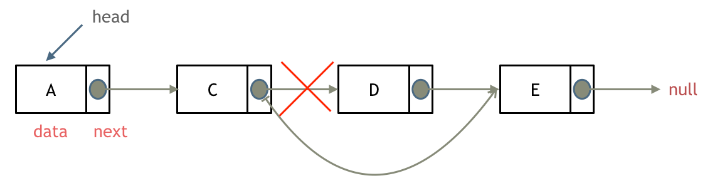
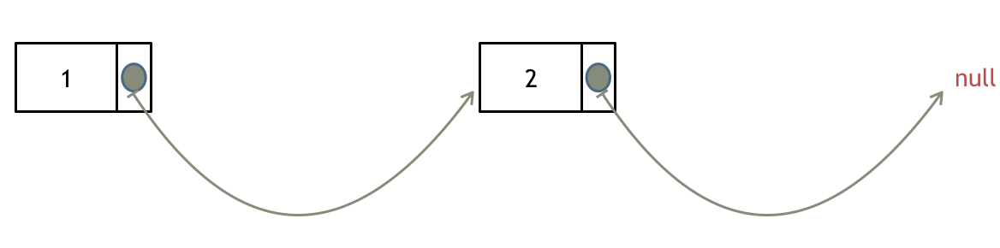
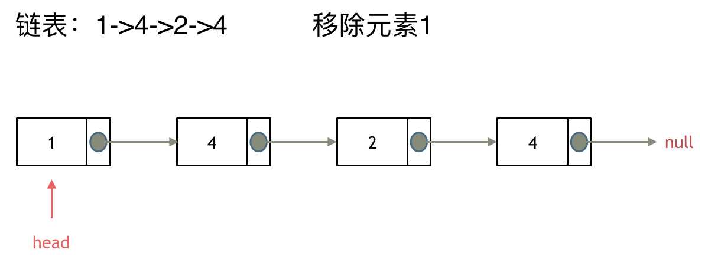
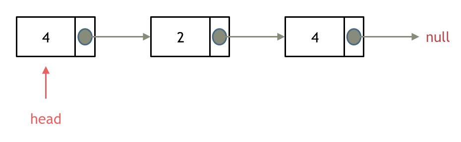

# 1. 关于链表，你该了解这些！

什么是链表，链表是一种通过指针串联在一起的线性结构，每一个节点由两部分组成，一个是数据域一个是指针域（存放指向下一个节点的指针），最后一个节点的指针域指向null（空指针的意思）。

链接的入口节点称为链表的头结点也就是head。

如图所示：


## 链表的类型

### 单链表

上面说的就是单链表。

### 双链表

* 单链表中的节点只能指向节点的下一个节点。

* 双链表：每一个节点有两个指针域，一个指向下一个节点，一个指向上一个节点。

* 双链表 既可以向前查询也可以向后查询。

* 如图所示：

  


### 循环链表

* 循环链表，顾名思义，就是链表首尾相连。

* 循环链表可以用来解决约瑟夫环问题。


## 链表的存储方式

了解完链表的类型，再来说一说链表在内存中的存储方式。

数组是在内存中是连续分布的，但是链表在内存中可不是连续分布的。

链表是通过指针域的指针链接在内存中各个节点。

所以链表中的节点在内存中不是连续分布的 ，而是散乱分布在内存中的某地址上，分配机制取决于操作系统的内存管理。

如图所示：


这个链表起始节点为2， 终止节点为7， 各个节点分布在内存个不同地址空间上，通过指针串联在一起。

## 链表的定义

接下来说一说链表的定义。

链表节点的定义，很多同学在面试的时候都写不好。

这是因为平时在刷leetcode的时候，链表的节点都默认定义好了，直接用就行了，所以同学们都没有注意到链表的节点是如何定义的。

而在面试的时候，一旦要自己手写链表，就写的错漏百出。

这里我给出C/C++的定义链表节点方式，如下所示：

```
// 单链表
struct ListNode {
    int val;  // 节点上存储的元素
    ListNode *next;  // 指向下一个节点的指针
    ListNode(int x) : val(x), next(NULL) {}  // 节点的构造函数
};
```

有同学说了，我不定义构造函数行不行，答案是可以的，C++默认生成一个构造函数。

但是这个构造函数不会初始化任何成员变量，下面我来举两个例子：

通过自己定义构造函数初始化节点：

```
ListNode* head = new ListNode(5);
```

使用默认构造函数初始化节点：
```
ListNode* head = new ListNode();
head->val = 5;
```

所以如果不定义构造函数使用默认构造函数的话，在初始化的时候就不能直接给变量赋值！

## 链表的操作

### 删除节点

删除D节点，如图所示：



只要将C节点的next指针 指向E节点就可以了。

那有同学说了，D节点不是依然存留在内存里么？只不过是没有在这个链表里而已。

是这样的，所以在C++里最好是再手动释放这个D节点，释放这块内存。

其他语言例如Java、Python，就有自己的内存回收机制，就不用自己手动释放了。

### 添加节点

如图所示：


可以看出链表的增添和删除都是$O(1)$操作，也不会影响到其他节点。

但是要注意，要是删除第五个节点，需要从头节点查找到第四个节点通过next指针进行删除操作，查找的时间复杂度是$O(n)$。

## 性能分析

再把链表的特性和数组的特性进行一个对比，如图所示：


数组在定义的时候，长度就是固定的，如果想改动数组的长度，就需要重新定义一个新的数组。

链表的长度可以是不固定的，并且可以动态增删， 适合数据量不固定，频繁增删，较少查询的场景。

相信大家已经对链表足够的了解，后面我会讲解关于链表的高频面试题目，我们下期见！

# 移除链表元素

## 题目

题意：删除链表中等于给定值 val 的所有节点。

> 示例 1：
>
> 输入：head = [1,2,6,3,4,5,6], val = 6
>
> 输出：[1,2,3,4,5]

> 示例 2：
> 
> 输入：head = [], val = 1
> 
> 输出：[]

> 示例 3：
> 
> 输入：head = [7,7,7,7], val = 7
> 
> 输出：[]

## 思路

* 这里以链表 1 4 2 4 来举例，移除元素4。
* 
* 

如果使用C，C++编程语言的话，不要忘了还要从***内存中删除这两个移除的节点***， 清理节点内存之后如图：



当然如果使用java ，python的话就不用手动管理内存了。

这种情况下的移除操作，就是让节点next指针直接指向下下一个节点就可以了，

那么因为单链表的特殊性，只能指向下一个节点，刚刚删除的是链表的中第二个，和第四个节点，那么如果删除的是头结点又该怎么办呢？

这里就涉及如下链表操作的两种方式：

  *  直接使用原来的链表来进行删除操作。
  *  设置一个虚拟头结点在进行删除操作。

来看第一种操作：直接使用原来的链表来进行移除。



移除头结点和移除其他节点的操作是不一样的，因为链表的其他节点都是通过前一个节点来移除当前节点，而头结点没有前一个节点。

所以头结点如何移除呢，其实只要将头结点向后移动一位就可以，这样就从链表中移除了一个头结点。


依然别忘将原头结点从内存中删掉



这样移除了一个头结点，是不是发现，在单链表中移除头结点 和 移除其他节点的操作方式是不一样，其实在写代码的时候也会发现，需要单独写一段逻辑来处理移除头结点的情况。

那么可不可以 以一种统一的逻辑来移除 链表的节点呢。

***可以设置一个虚拟头结点***

* 依然还是在这个链表中，移除元素1。


这里来给链表添加一个虚拟头结点为新的头结点，此时要移除这个旧头结点元素1。


最后呢在题目中，return 头结点的时候，别忘了 
```
return dummyNode->next;
```
这才是新的头结点

## 代码

* 直接使用原来的链表来进行移除节点操作：

```
class Solution {
public:
    ListNode* removeElements(ListNode* head, int val) {
        // 删除头结点
        while (head != NULL && head->val == val) { // 注意这里不是if
            ListNode* tmp = head;
            head = head->next;
            delete tmp;
        }

        // 删除非头结点
        ListNode* cur = head;
        while (cur != NULL && cur->next!= NULL) {
            if (cur->next->val == val) {
                ListNode* tmp = cur->next;
                cur->next = cur->next->next;
                delete tmp;
            } else {
                cur = cur->next;
            }
        }
        return head;
    }
};
```
设置一个虚拟头结点在进行移除节点操作：
```
class Solution {
public:
    ListNode* removeElements(ListNode* head, int val) {
        ListNode* dummyHead = new ListNode(0); // 设置一个虚拟头结点
        dummyHead->next = head; // 将虚拟头结点指向head，这样方面后面做删除操作
        ListNode* cur = dummyHead;
        while (cur->next != NULL) {
            if(cur->next->val == val) {
                ListNode* tmp = cur->next;
                cur->next = cur->next->next;
                delete tmp;
            } else {
                cur = cur->next;
            }
        }
        head = dummyHead->next;
        delete dummyHead;
        return head;
    }
};
```

# 3. 设计链表


